## MITRE ATT&CKs bug: In its open source project on Github
### Introduction

On March 6, 2023 I responsibly disclosed a local DoS bug I found (by chance) in the MITRE ATT&CK Open Source software project. 

This was not part of a red team, and I was not actively bug hunting when I found this bug. I had a legitimate need to find information on MITRE ATT&CK, and I just so happened to find a bug. In the following two screenshots, you'll notice the spinning wheel as I am attempting to type my query into the search bar; the MITRE ATT&CK team was able to reproduce my bug when I reported it on March 6th, and I was encouraged to try to recommend a fix -- which I did (also included), developing a quick PoC of my algorithm on [ideone](patch.poc.html).


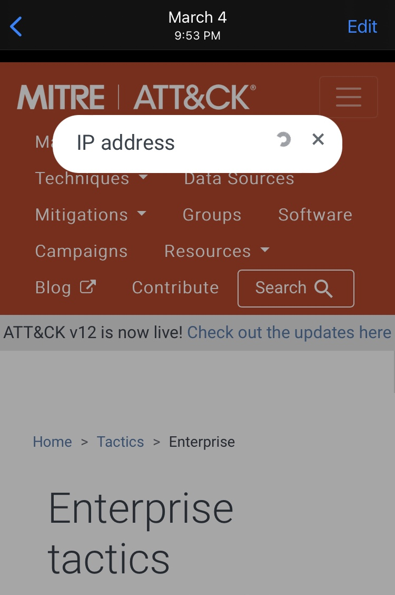

I did not attempt to exploit this bug; I responsibly disclosed the issue once I realized that the spinning wheel wouldn't ever stop spinning.

Although the patch for this bug was released at the end of April, I thought it would be best to wait the full 90 days before releasing my report to be on the safe side. Since I wasn't actually hunting for bugs on this website, hypothesizing about the root cause of this bug is helpful for my growth as a vulnerability researcher.

### What is MITRE ATT&CK

```text
The MITRE ATT&CK framework, launched in 2015, has been described 
by Computer Weekly as "the free, globally accessible service that offers 
comprehensive and current cyber security threat information" to organizations,
and by TechTarget as a "global knowledge base of threat activity, techniques 
and models". The framework has been used by the Cybersecurity and 
Infrastructure Security Agency and the FBI. Version 8.0 was released in 2020. 
According to a 2020 study published by the University of California, Berkeley 
and security software company McAfee, 80 percent of companies use the framework 
for cybersecurity.

Source: https://en.wikipedia.org/wiki/Mitre_Corporation#Cybersecurity_and_election_integrity
```

### Root-Cause Analysis of a 3-year Old Client-Side DoS Bug in MITRE's ATT&CK Website Open Source Project
#### MITRE ATT&CK's bug dissection and PoC

I've isolated what I believe to be the true root cause of the issue; the algorithm from various commits can be found in the following directory [resultToHTML](resources/commit_history_src/resultToHTML/). Keep in mind that the patch for the bug I reported can be found in [e3869b671041f781358694b4a3dcc2cd6d1b63fd](resources/commit_history_src/resultToHTML/e3869b671041f781358694b4a3dcc2cd6d1b63fd.resultToHtml.js). 

Instead of manually walking through all of the changes, I thought this would be an opportunity to utilize [hashify](https://github.com/whitetiger45/hashify) since there are so many changes! Before diving into the diff's, here is the snippet of resultToHTML function that I believe to be responsible for the local DoS I experienced on both MacOS and iOS:

```js
let buffer = 200; //2* buffer is roughly the size of the result preview
.
.
.
        // create preview html
        let preview = result.content;
        
        // Find a position where the search words occur near each other
        let positions = []

        this.current_query.words.forEach(function(searchword) {
            let currMatches;
            while((currMatches = searchword.regex.exec(preview)) !== null) {
                positions.push({
                    index: searchword.regex.lastIndex,
                    word: searchword.word
                });
            }
        })
.
.
.
        positions.sort(function(a,b) { return a.index - b.index });

        for (let i = 0; i < positions.length; i++) {
            const position = positions[i];
            let word = position.word;
            let index = position.index;

            // find out how far we have to go from this position to find all words
            let foundWords = new Set();
            foundWords.add(position.word);

            let totalDist = 0; //total distance between words for this combination
            let max = index; //leftmost word find
            let min = index //rightmost word find

            if (setsEqual(allWords, foundWords)) {
                //1 word search
                best.min = index + 10;
                best.max = index - 10
                break;
            } else {
                // search around this word
                for (let j = 0; i + j < positions.length || i - j > 0; j++) {
                    // search j ahead
                    let exceeded = 0;
                    if (i + j < positions.length - 1) {
                        let ahead = positions[i + j];
                        let dist = ahead.index - index;
                        if (dist > buffer) { //exceeded buffer
                            exceeded++;
                        } else if (!foundWords.has(ahead.word)) { // found a word
                            foundWords.add(ahead.word);
                            max = ahead.index;
                            totalDist += ahead.index - index
                        }
                    }
                    //search j behind
                    if (i - j >= 0) {
                        let behind = positions[i - j];
                        let dist = index - behind.index;
                        if (dist > buffer) { //exceeded buffer
                            exceeded++;
                        } else if (!foundWords.has(behind.word)) { // found a word
                            foundWords.add(behind.word);
                            min = behind.index;
                            totalDist += index - behind.index;
                        }
                    }
                    if (setsEqual(allWords, foundWords) || exceeded == 2) { //found all the words in proximity, or both searches exceeded the buffer
                        break;
                    }
                }

```

Here is the patch, from:

```js
[1: mitre_attacks_bug/resources/commit_history_src/resultToHTML/58f5cee09bcfb4ffa69c59855b7636e08e4f73e5.resultToHtml.js]
[2: mitre_attacks_bug/resources/commit_history_src/resultToHTML/e3869b671041f781358694b4a3dcc2cd6d1b63fd.resultToHtml.js]

[1->2 line 1]:    * Converts a search result object to an HTML string with highlighted search words.
[1->2 line 2]:    * The HTML string will include the result's title, a link to the result's path, and a preview of the content
[1->2 line 3]:    * with search words highlighted. The preview will be trimmed to a buffer size around the found words.
[1->2 line 4]:    *
[1->2 line 5]:    * @private
[1->2 line 6]:    * @function
[1->2 line 7]:    * @param {Object} result - A search result object containing an `id`, a `title`, a `path`, and a `content` property.
[1->2 line 8]:    * @returns {string} An HTML string representing the search result with highlighted search words.
[1->2 line 10]:   #resultToHTML(result) {
[1->2 line 26]:     this.currentQuery.words.forEach((searchWord) => {
[1->2 line 36]:     positions.sort((a, b) => a.index - b.index);
[1->2 line 45]:     const allWords = new Set(this.currentQuery.words.map((word) => word.word));
[1->2 line 80]:             if (dist > this.buffer) { // exceeded buffer
[1->2 line 92]:             if (dist > this.buffer) { // exceeded buffer
[1->2 line 120]:     const left = Math.max(0, best.min - this.buffer);
[1->2 line 121]:     const right = Math.min(preview.length, best.max + this.buffer);
[1->2 line 129]:     preview = preview.replace(this.currentQuery.joined, "<span class='search-word-found'>$1</span>");
[1->2 line 131]:     title = title.replace(this.currentQuery.joined, "<span class='search-word-found'>$1</span>");
[1->2 line 140]:                     ${preview}
[1->2 line 141]:                 </div>
[1->2 line 142]:             </div>
[1->2 line 143]:         `; // end template
[1->2 line 144]:   }
```

To:

```js
[1: mitre_attacks_bug/resources/commit_history_src/resultToHTML/58f5cee09bcfb4ffa69c59855b7636e08e4f73e5.resultToHtml.js]
[2: mitre_attacks_bug/resources/commit_history_src/resultToHTML/e3869b671041f781358694b4a3dcc2cd6d1b63fd.resultToHtml.js]

[2->1 line 1]:      * parse the result to the HTML required to render it
[2->1 line 2]:      * @param result object of format {title, path, content} which describes a page on the site
[2->1 line 4]:   result_to_html(result) {
[2->1 line 17]:     this.current_query.words.forEach((searchWord) => {
[2->1 line 27]:     positions.sort((a, b) => {
[2->1 line 28]:       console.debug(`a=${a}`);
[2->1 line 29]:       console.debug(`b=${b}`);
[2->1 line 30]:       return a.index - b.index;
[2->1 line 40]:     const allWords = new Set(this.current_query.words.map((word) => word.word));
[2->1 line 75]:             if (dist > buffer) { // exceeded buffer
[2->1 line 87]:             if (dist > buffer) { // exceeded buffer
[2->1 line 115]:     const left = Math.max(0, best.min - buffer);
[2->1 line 116]:     const right = Math.min(preview.length, best.max + buffer);
[2->1 line 124]:     preview = preview.replace(this.current_query.joined, "<span class='search-word-found'>$1</span>");
[2->1 line 126]:     title = title.replace(this.current_query.joined, "<span class='search-word-found'>$1</span>");
```
#### Root-cause analysis with hypothesis of the reason the user experiences a local DoS

My hypothesis regarding the root cause of this bug is as follows:

1. The variable `buffer` is initialized to 200 
2. The variable `exceeded` is reset to 0 each time variable `j` is incremented, so the variable `exceeded` will not be incremented if the word used to set the variable `ahead` occurs in close proximity to the word used to set the variable `position` inside of the function `result_to_html`
3. There is no limit on the number of words that make up each word in the search query
4. The order of the queried words list is sorted, which could actually change the result set returned to the user
5. Common words are not removed from the search query (i.e. *and* in **Command and Control**), and after sorting the list the queried words, the index of a common word in the preview content will be set by the last index of that common word
6. If the search query list's length is > 1, then the sets_equal call will always return false, because the variable `foundWords` is reset each time we increment variable `i`
7. The variable `exceeded` is never incremented twice, and the set comparison always fails because `allWords` is never equal to `foundWords`, so the search always searches each JSON object for each word in the search query -- boundless searching

After isolating what I believe to be problematic function, I wrote a [PoC](bug.demo.py) to test my hypothesis, and am including it as part of this write-up. The PoC does not actually issue a request; it just simulates searching for strings in the exact manner this is done in the resultToHTML function. I am including the [output](mitre.attack.bug.sim.log) from running my PoC with the default query of "in a network".

#### Analysis of the history of this function

I wanted to know how long ago this bug was introduced into the code; I also wanted to know if the branch under development purporting to address this issue was on track to squash it.

Here is a timeline, in photos, of the commit history:

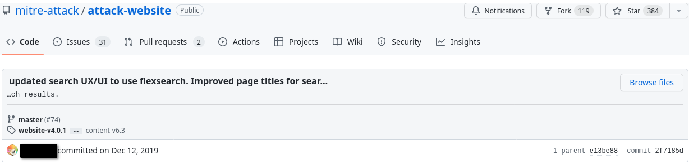

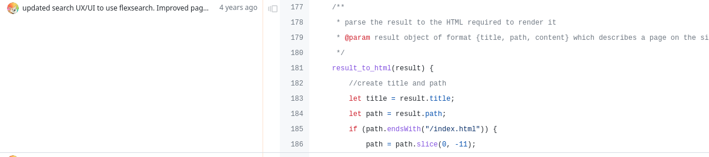

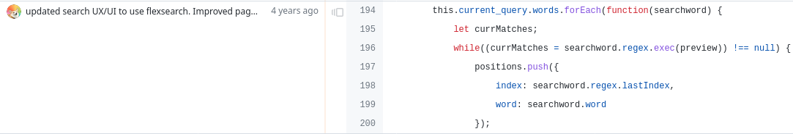

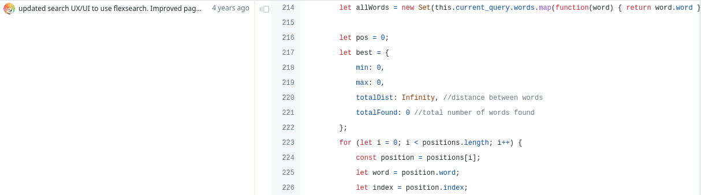

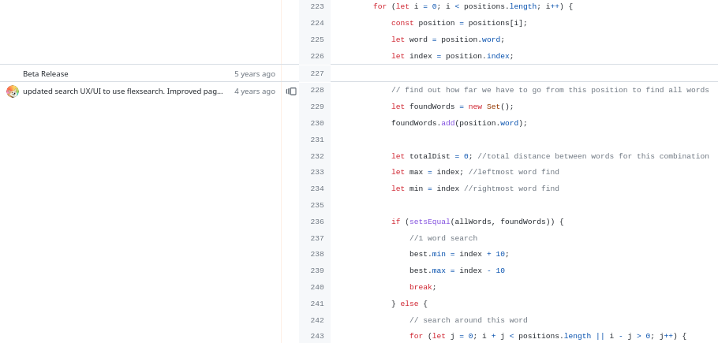

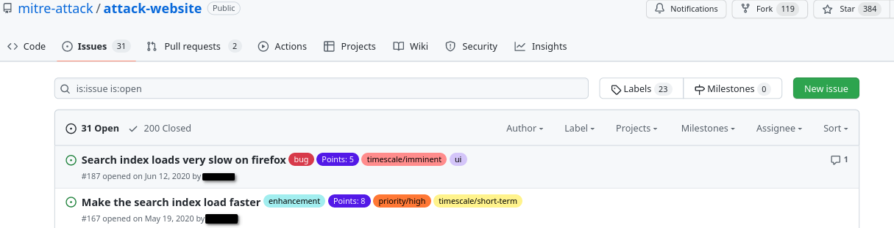

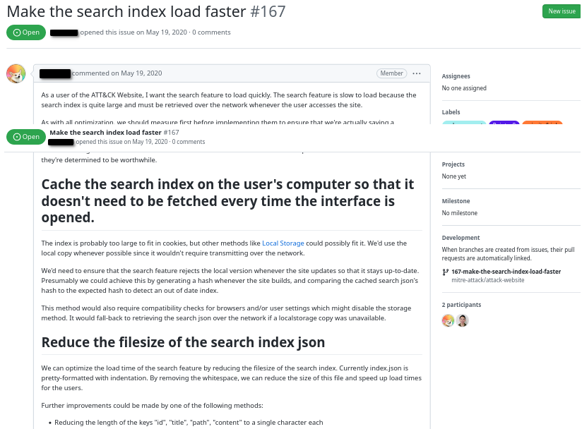

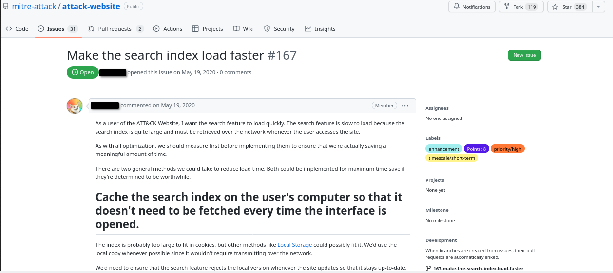

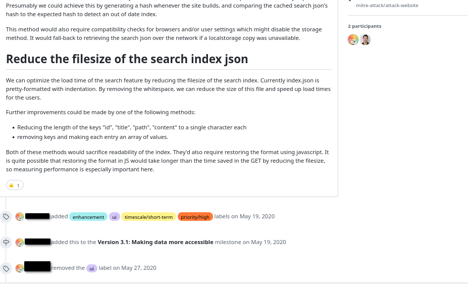


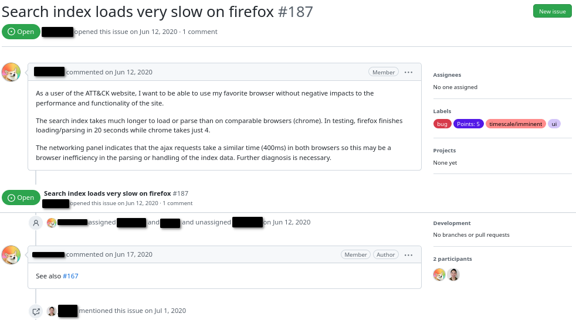

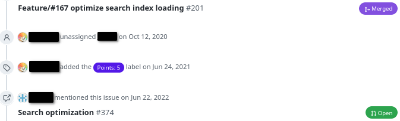

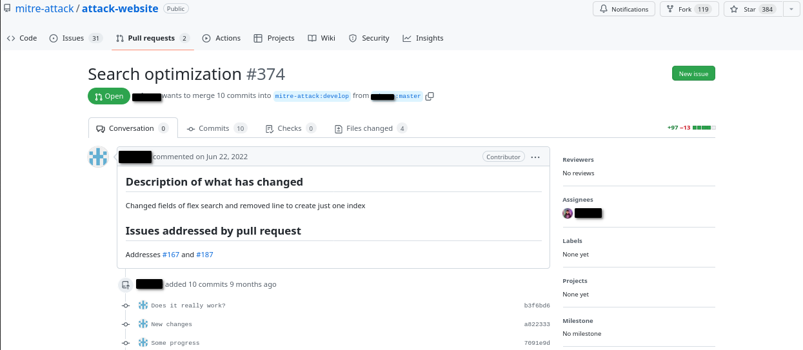

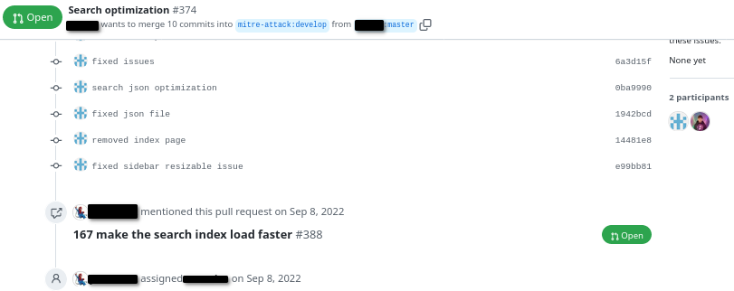

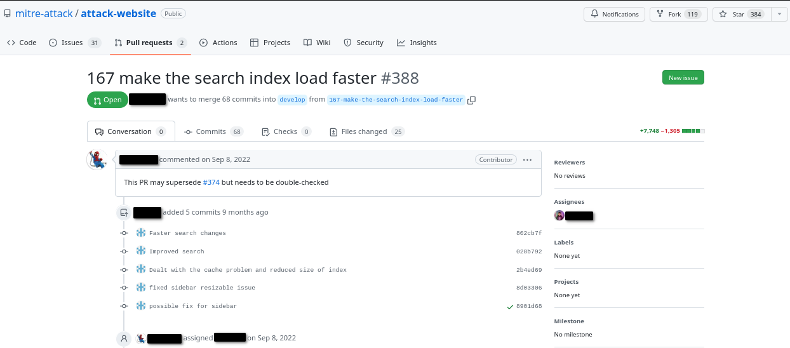

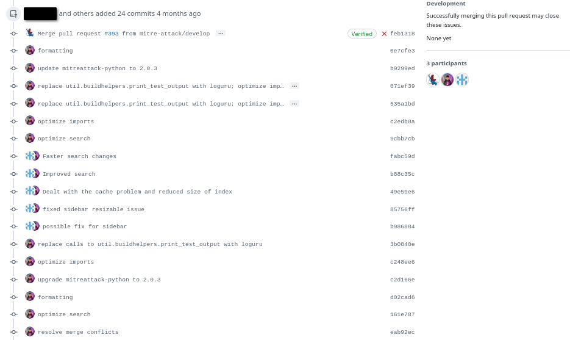

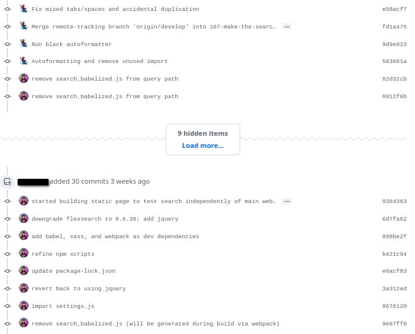

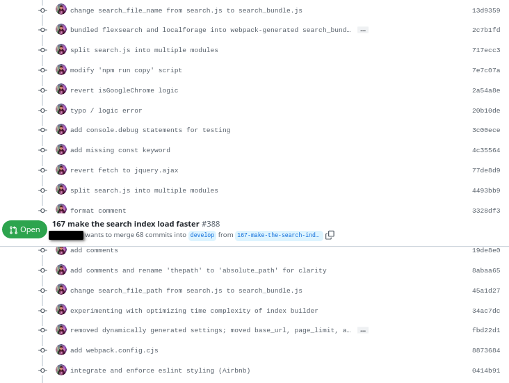

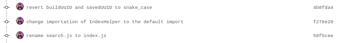

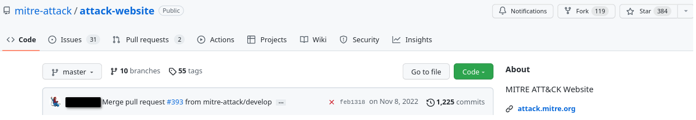

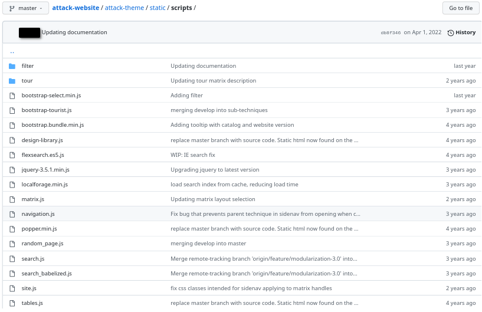

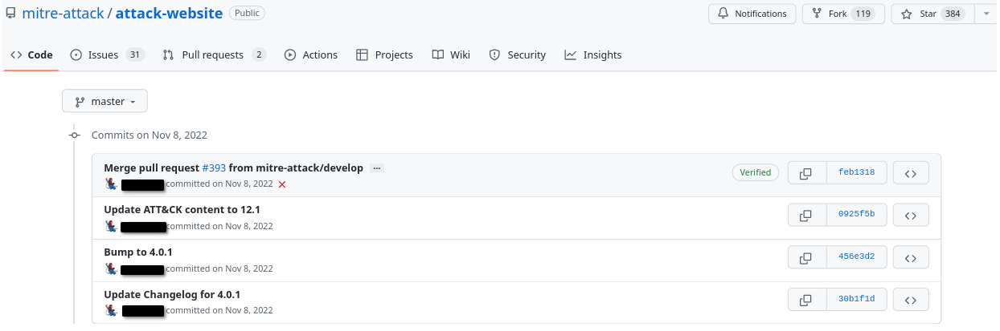

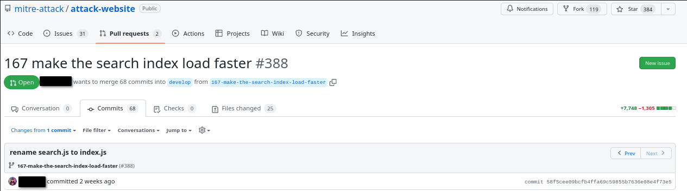

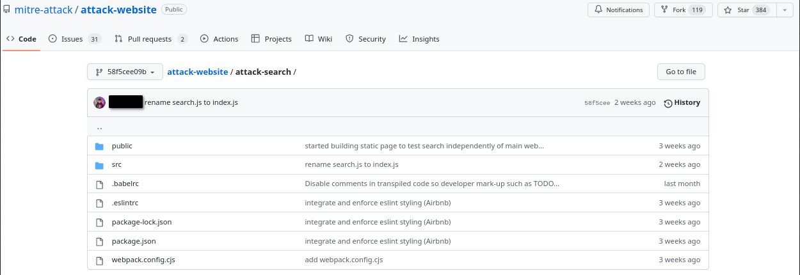


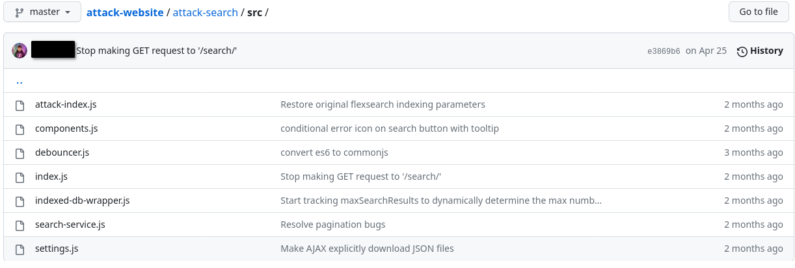

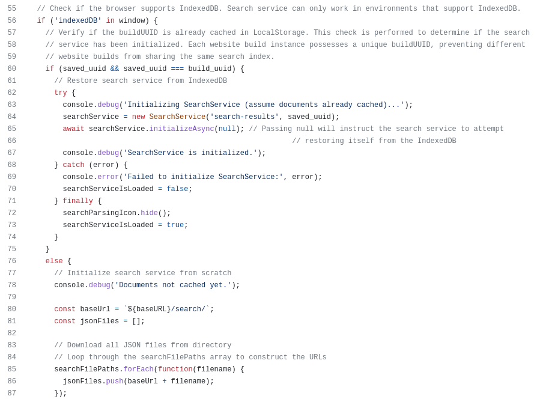

#### Comments/Thoughts

1. This bug wasn't caught prior to the initial release and deployment of the MITRE ATT&CK Website on the live production server @[attack.mitre.org](https://attack.mitre.org) back in the 1st Quarter of 2020.
2. This logic bug had not been properly diagnosed and corrected in the ~3+ years since its initial release and deployment on the production server.
3. This local DoS bug wasn't caught and immediately patched during regression testing at any point in time between 2020 and 2023.

#### MITRE ATT&CK's bug and its impact

The reason I believe this bug was worth a write-up is because of recently reading about requirements for Federal Agencies regarding DoS protection, testing and evaluation. I specifically am relying on [NIST SP 800-53 Rev. 5: Security and Privacy Controls for Information Systems and Organizations](https://csrc.nist.gov/publications/detail/sp/800-53/rev-5/final):

```bash
[OMB A-130] imposes information security and privacy requirements 
with which federal agencies must comply when managing information resources.
.
.
.
[OMB A-130] requires federal agencies to implement the NIST Risk 
Management Framework for the selection of controls for federal 
information systems. [EO 13800] requires federal agencies to implement 
the NIST Framework for Improving Critical Infrastructure Cybersecurity 
to manage cybersecurity risk.
```
Because DoS's are usually out of scope for bug bounties (and since I wasn't activtely hunting for bugs when I discovered this bug) I was unaware that there are requirements that some organizations are required to be in compliance with regarding protection from such attacks; section SC-5 of [NIST SP 800-53 Rev.5](https://csrc.nist.gov/publications/detail/sp/800-53/rev-5/final) was useful for improving my understanding; as was section SA-11 (developer testing and evaluation).

#### Legacy references in the wild to the live attack.mitre.org site

- Author: Moti Gindi Corporate Vice President, Microsoft 365 Security
- Date 2021.05.05 - Stopping Carbanak+FIN7: How Microsoft led in the MITRE Engenuity ATT&CK Evaluation [original](https://www.microsoft.com/en-us/security/blog/2021/05/05/stopping-carbanakfin7-how-microsoft-led-in-the-mitre-engenuity-attck-evaluation/)[local](resources/misc/stopping-carbanakfin7-how-microsoft-led-in-the-mitre-engenuity-attck-evaluation.html)
- 2021.04.21 - MITRE Engenuity ATT&CK Evaluation proves Microsoft Defender for Endpoint stops advanced attacks across platforms [original](https://www.microsoft.com/en-us/security/blog/2021/04/21/mitre-engenuity-attck-evaluation-proves-microsoft-defender-for-endpoint-stops-advanced-attacks-across-platforms/)[local](resources/misc/mitre-engenuity-attck-evaluation-proves-microsoft-defender-for-endpoint-stops-advanced-attacks-across-platforms.html)

```html
.
.
.
The...concentrated on advanced threat actors <a href="https://attack.mitre.org/groups/G0046/" target="_blank" rel="noopener">known to the industry as FIN7</a> and <a href="https://attack.mitre.org/groups/G0008/" target="_blank" rel="noopener">Carbanak (also called Carbon Spider)</a>. This year’s rigorous evaluation included new benchmarks of detection and protection simulations of more than 174 steps across the attack chain, affecting both Windows client endpoints, servers, and, for the first time, Linux devices.</p>
.
.
.
```

### Disclosure Timeline

- 2023-03-06 
    - Bug responsibly disclosed to MITRE ATT&CK team
    - Bug confirmed by MITRE ATT&CK
    - Root cause analysis, CVE-worthiness-discussion, and pseudo-code of O(N) algorithm and prototype delivered to MITRE ATT&CK team
-  2023-03-08
    - Diffing of search.js containing the O(N^2) from commit history over 3-years after initial commit containing the bug
- 2023-04-25
    - 3 year old local DoS bug is patched in index.js of commit e3869b671041f781358694b4a3dcc2cd6d1b63fd
- 2023-06-11 - Report released, after 90-day responsible disclosure period has lapsed for 3+ year old bug in open source software project.

### Additional resources

1. [Wiz Labs: Azure Active Directory Bing Misconfiguration](https://www.wiz.io/blog/azure-active-directory-bing-misconfiguration)
2. [BH19 - Denial of Service with a Fistful of Packets: Exploiting Algorithmic Complexity Vulnerabilities](https://youtu.be/UdTpa-n9L-g)
3. [LiveOverflow: Public Penetration Test Reports - Learning Resource](https://youtu.be/qNLMuls2BBA)
